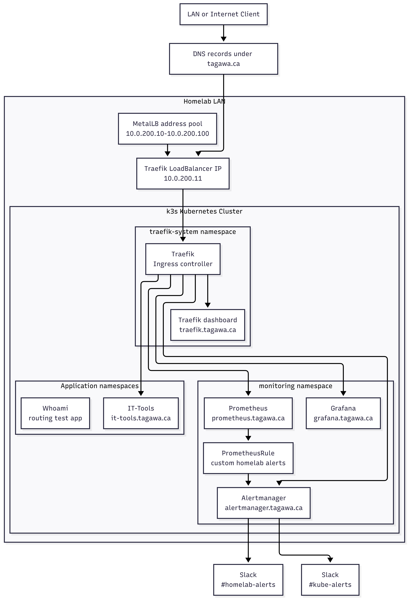
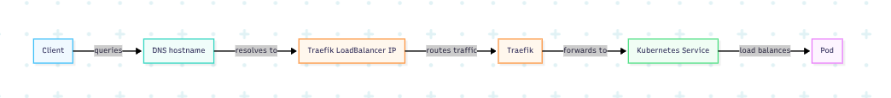
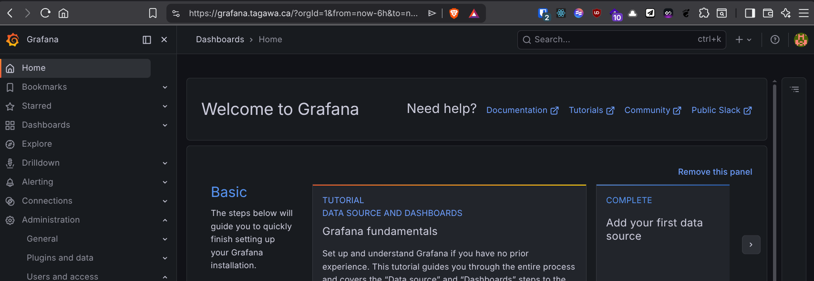
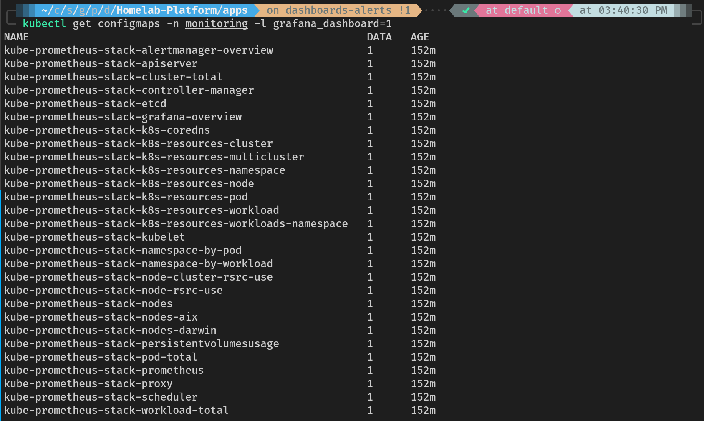
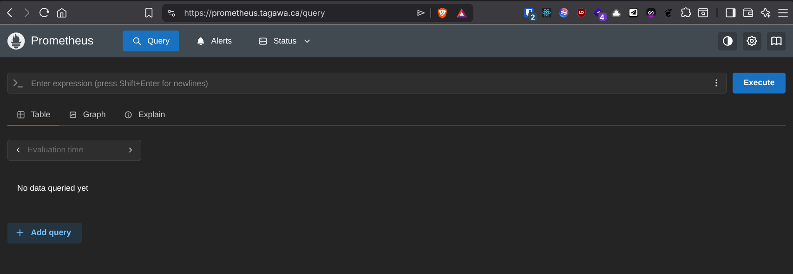
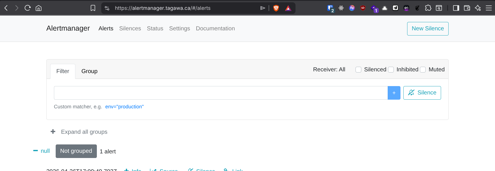
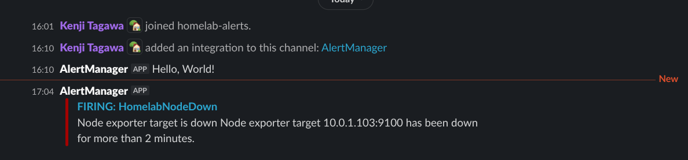
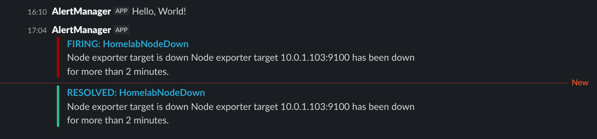

# Homelab Platform

This repository manages the Kubernetes platform layer of my homelab.

It contains the manifests, Helm values, and operational documentation I use to run a four-node k3s cluster with LAN load balancing, ingress, TLS, application deployment, observability, and Slack alerting.

The goal is to keep the platform understandable from Git: what is deployed, how traffic enters the cluster, how services are exposed, and how the environment is monitored.

## What This Project Shows

- Kubernetes manifests organized by namespace and service boundary
- MetalLB providing `LoadBalancer` IPs on a bare-metal LAN
- Traefik handling ingress, HTTPS, certificate management, and routing
- kube-prometheus-stack providing Prometheus, Grafana, Alertmanager, dashboards, and alert rules
- Slack alert routing for both custom homelab alerts and kube-prometheus-stack alerts
- Documentation for the current setup, tradeoffs, and troubleshooting paths
- A repository structure that can move toward GitOps with ArgoCD later

## Architecture Overview

The cluster runs on four Ubuntu 24.04 nodes with k3s `v1.32.13+k3s1`.

| Node       | IP Address | Role                         |
| ---------- | ---------- | ---------------------------- |
| homelab-01 | 10.0.1.101 | control-plane, etcd, master  |
| homelab-02 | 10.0.1.102 | control-plane, etcd, master  |
| homelab-03 | 10.0.1.103 | control-plane, etcd, master  |
| homelab-04 | 10.0.1.104 | worker                       |

The Kubernetes API is reached through `10.0.1.210:6443`.

MetalLB assigns LAN-facing `LoadBalancer` addresses from:

```text
10.0.200.10-10.0.200.100
```

Traefik currently receives:

```text
10.0.200.11
```

Service hostnames under `tagawa.ca` point to Traefik. Traefik then routes requests to the correct Kubernetes service by hostname.



## Traffic Flow

```text
Client
  -> DNS hostname
  -> Traefik LoadBalancer IP
  -> Traefik
  -> Kubernetes Service
  -> Pod
```

Example:

```text
it-tools.tagawa.ca
  -> 10.0.200.11
  -> Traefik
  -> it-tools Service
  -> it-tools Pod
```



## Stack

| Area          | Tooling                          | Purpose                                      |
| ------------- | -------------------------------- | -------------------------------------------- |
| Kubernetes    | k3s                              | Lightweight Kubernetes distribution          |
| LoadBalancer  | MetalLB                          | LAN IP allocation for bare-metal services    |
| Ingress       | Traefik                          | HTTP routing, HTTPS, dashboard, metrics      |
| TLS           | Let's Encrypt and Cloudflare DNS | Public certificates through DNS challenge    |
| Observability | kube-prometheus-stack            | Prometheus, Grafana, Alertmanager, dashboards |
| Alerts        | Alertmanager and Slack           | Firing and resolved notifications            |
| App example   | IT-Tools                         | Self-hosted utility application              |

## Exposed Services

| Service      | Hostname               | Namespace      | Backend                                  |
| ------------ | ---------------------- | -------------- | ---------------------------------------- |
| Traefik      | traefik.tagawa.ca      | traefik-system | `api@internal`                           |
| IT-Tools     | it-tools.tagawa.ca     | it-tools       | `it-tools`                               |
| Grafana      | grafana.tagawa.ca      | monitoring     | `kube-prometheus-stack-grafana`          |
| Prometheus   | prometheus.tagawa.ca   | monitoring     | `kube-prometheus-stack-prometheus`       |
| Alertmanager | alertmanager.tagawa.ca | monitoring     | `kube-prometheus-stack-alertmanager`     |

Prometheus and Alertmanager are exposed for homelab debugging. They do not have production-grade authentication in this setup.

## Screenshots

The ingress baseline is the shared path used by IT-Tools, Grafana, Prometheus, Alertmanager, the Traefik dashboard, and future services.


Grafana is exposed through Traefik and includes the default dashboards from kube-prometheus-stack.





Prometheus and Alertmanager are exposed for day-to-day homelab visibility.





Slack receives firing and resolved alert notifications from Alertmanager.





## Repository Layout

```text
apps/
  it-tools/
  metallb/
  monitoring/
  traefik/
  whoami/

docs/
  infrastructure/
  kubernetes-learnings/
  observability/
```

The `apps/` directory is organized by namespace and application boundary. This keeps troubleshooting simple because the folder structure mirrors how resources are grouped inside the cluster.

## Key Documentation

- [Homelab Infrastructure](docs/homelab.md)
- [Repository Structure](docs/structure.md)
- [Namespace Strategy](docs/namespaces.md)
- [MetalLB](docs/infrastructure/metallb.md)
- [Traefik](docs/infrastructure/traefik.md)
- [Ingress Baseline](docs/infrastructure/ingress-baseline.md)
- [DNS for Homelab Ingress](docs/infrastructure/dns-for-ingress.md)
- [TLS Certificate Strategy](docs/infrastructure/tls-certificate-strategy.md)
- [kube-prometheus-stack](docs/observability/kube-prometheus-stack.md)
- [Alerting](docs/observability/alerting.md)

## Future Improvements

- Add ArgoCD so the cluster continuously reconciles this repository
- Add a Git-safe secret workflow such as sealed secrets or external secrets
- Add more custom Prometheus alerts for homelab-specific failure modes
- Add more application examples behind Traefik
