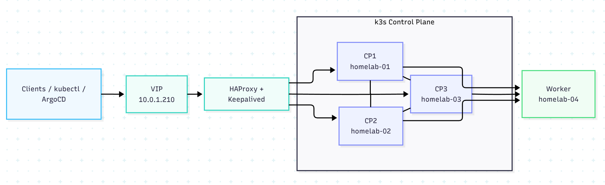

# Ingress Baseline

## Purpose

The ingress baseline is the shared traffic path that lets devices on the LAN reach applications running inside the k3s cluster.

Once this baseline is working, exposing a new app usually means adding:

- a Kubernetes `Service`
- an `Ingress` or `IngressRoute`
- a DNS record that points the hostname to Traefik

The baseline is not tied to one app. IT-Tools, Grafana, Prometheus, Alertmanager, the Traefik dashboard, and future services all use the same path.

## How Traffic Flows

```text
Client on LAN
  -> DNS hostname
  -> Traefik LoadBalancer IP
  -> Traefik
  -> Kubernetes Service
  -> Pod
```

Example:

```text
it-tools.tagawa.ca
  -> 10.0.200.11
  -> Traefik
  -> it-tools service
  -> it-tools pod
```



## What Each Piece Does

MetalLB gives Traefik a stable LAN IP. This cluster runs on bare-metal k3s, so there is no cloud load balancer. MetalLB fills that role by assigning addresses from the reserved homelab pool.

Traefik receives HTTP and HTTPS traffic on that LAN IP. It looks at the requested hostname and routes the request to the matching Kubernetes Service.

DNS points service hostnames like `it-tools.tagawa.ca` and `grafana.tagawa.ca` to the Traefik IP.

TLS is handled by Traefik with Let's Encrypt certificates issued through the Cloudflare DNS challenge.

## Repository Resources

MetalLB configuration:

```text
apps/metallb/
  namespace.yaml
  ip-address-pool.yaml
  l2-advertisement.yaml
  kustomization.yaml
```

Traefik configuration:

```text
apps/traefik/
  namespace.yaml
  values.yaml
  dashboard-ingressroute.yaml
  kustomization.yaml
```

## Validation

Verify MetalLB resources:

```bash
kubectl get ipaddresspools,l2advertisements -n metallb-system
```

Verify Traefik has a LAN IP:

```bash
kubectl get svc -n traefik-system
```

Verify HTTPS access through the full ingress path:

```bash
curl -I https://it-tools.tagawa.ca
```

Expected result:

```text
HTTP/2 200
```
